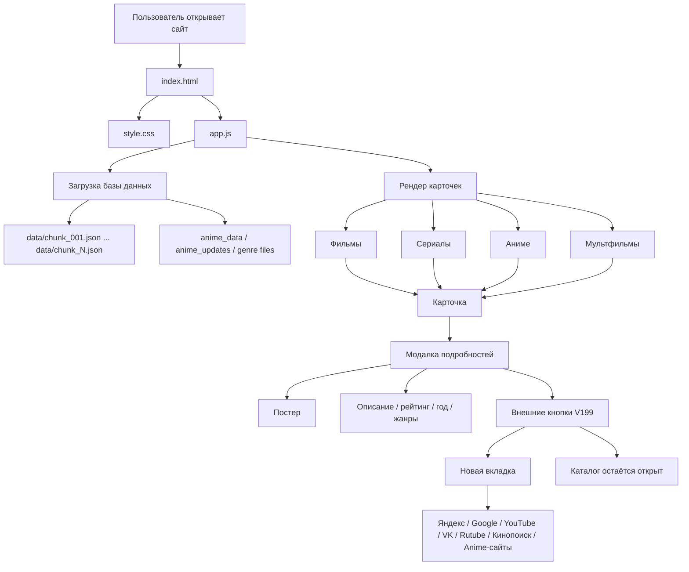
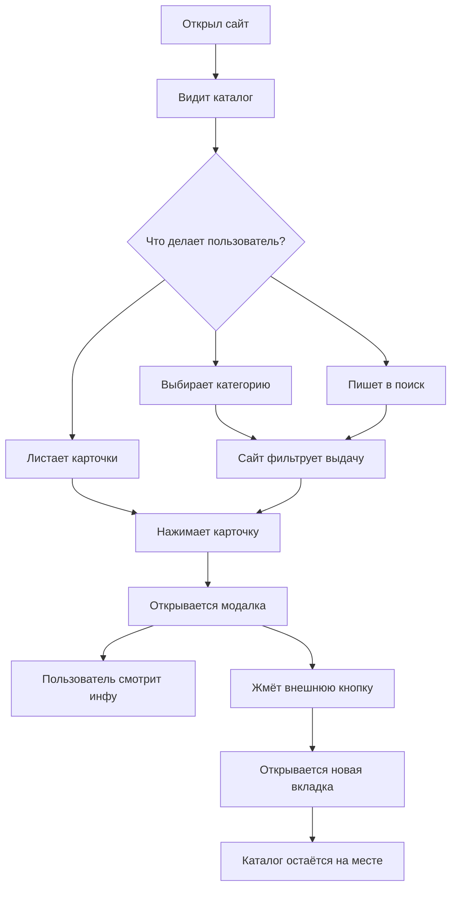
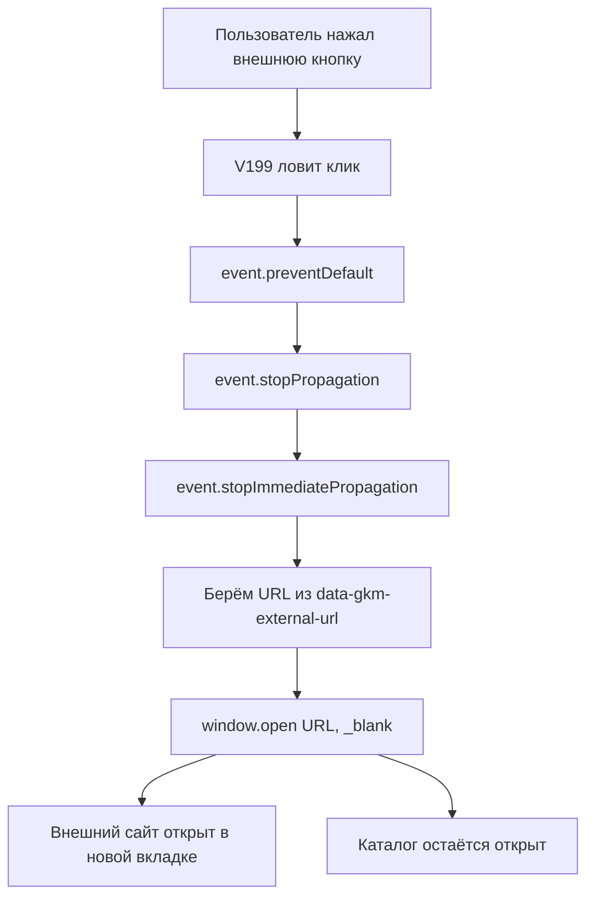
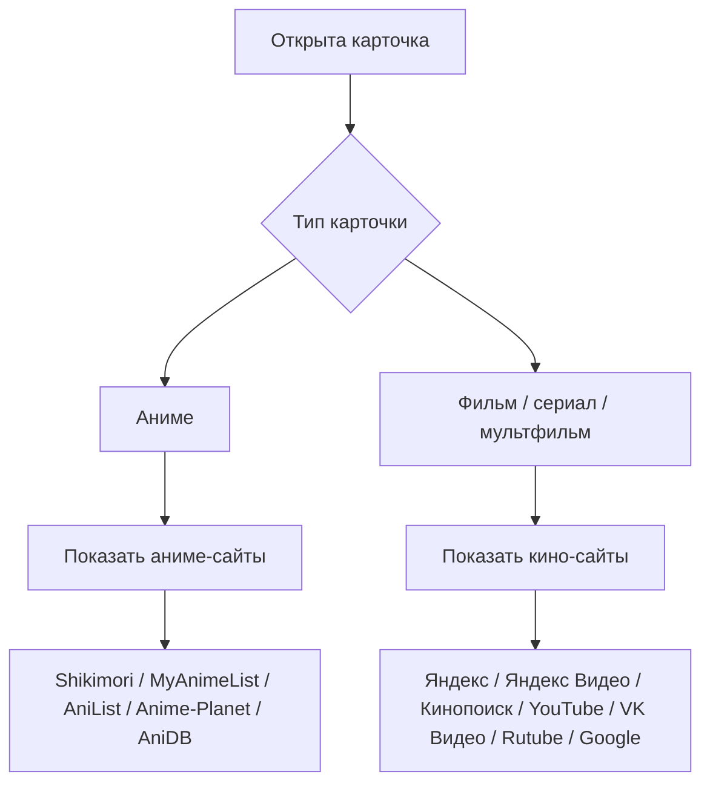
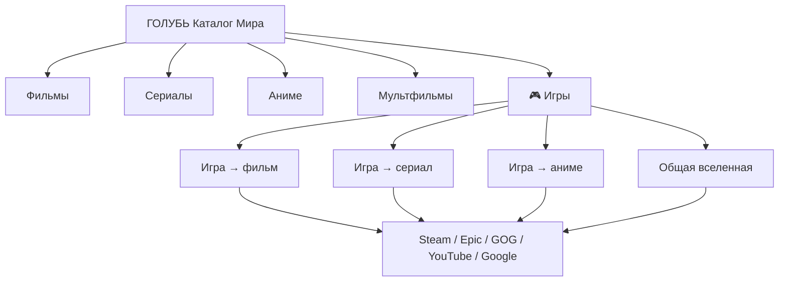

[GKM_PROJECT_SCHEME_V1.md](https://github.com/user-attachments/files/29471584/GKM_PROJECT_SCHEME_V1.md)
[Uploading GKM_PROJECT_SCHEME_V1.md…]()
# GKM PROJECT SCHEME V1
# «Голубь Каталог Мира» — карта сайта и логика проекта

Дата: 2026-06-29  
Проект: `films-series-best-5000`  
Назначение: каталог фильмов / сериалов / аниме / мультфильмов  
Текущая важная версия: `V199 CLEAN MODAL EXTERNAL LINKS`

---

## 0. Зачем нужен этот файл

Этот файл — не код, а **карта проекта**.

Он нужен, чтобы быстро понимать:

- какие файлы главные;
- как пользователь ходит по сайту;
- где живёт поиск;
- где живут карточки;
- где открывается модалка;
- где находятся внешние кнопки;
- какие старые патчи нельзя возвращать;
- куда смотреть, если сайт снова начнёт троить.

Правило проекта:

> Перед новым крупным патчем сначала смотреть эту схему, а не лепить новый костыль поверх старого.

---

## 1. Главная карта проекта



---

## 2. Основные файлы

| Файл / папка | За что отвечает | Важно |
|---|---|---|
| `index.html` | Каркас сайта | Подключает `style.css` и `app.js` |
| `style.css` | Внешний вид сайта | Карточки, сетка, модалка, мобильная версия |
| `app.js` | Главная логика сайта | Самый важный файл, тут поиск, фильтры, карточки, модалка |
| `data/chunk_*.json` | Основная база фильмов/сериалов/мультфильмов | Много файлов, не править вручную без нужды |
| `anime-tv/` | Отдельный блок/версия для anime-tv | Не путать с основной модалкой сайта |
| `.github/workflows/` | Автоматические GitHub-действия | Патчи/сборки/обновления |
| `README.md` | Краткое описание проекта | Сейчас почти пустой, можно расширить позже |

---

## 3. Как работает сайт для пользователя



---

## 4. Логика `app.js` крупными блоками

`app.js` — главный мозг сайта.

Примерная структура:

```txt
app.js
 ├─ Глобальные настройки и переменные
 ├─ Загрузка JSON-базы
 ├─ Нормализация данных
 ├─ Фильтры категорий
 ├─ Поиск
 ├─ Сортировка
 ├─ Рендер карточек
 ├─ Открытие модалки
 ├─ Заполнение модалки
 ├─ Внешние кнопки модалки
 │    └─ АКТУАЛЬНО: GKM V199 CLEAN MODAL EXTERNAL LINKS
 ├─ Мобильные обработчики
 └─ Дополнительные патчи версий
```

---

## 5. Модалка карточки

Модалка — это окно, которое открывается после клика на карточку.

В ней должно быть:

```txt
Модалка
 ├─ Постер
 ├─ Название
 ├─ Год
 ├─ Тип: фильм / сериал / аниме / мультфильм
 ├─ Рейтинг
 ├─ Жанры
 ├─ Описание
 ├─ Кнопки внешних сайтов
 └─ Закрытие модалки
```

Главное правило:

> Модалка не должна ломать текущую страницу и не должна уводить каталог на внешний сайт.

---

## 6. Внешние кнопки модалки

Актуальная версия:

```txt
GKM V199 CLEAN MODAL EXTERNAL LINKS
```

Задача V199:

- убрать дубли кнопок;
- открыть внешний сайт только в новой вкладке;
- не заменять текущий каталог внешним сайтом;
- для аниме показывать аниме-сайты;
- для фильмов/сериалов/мультфильмов показывать кино-сайты;
- работать на ПК и телефоне.

---

## 7. Схема внешних кнопок V199



---

## 8. Какие старые блоки нельзя возвращать

Эти блоки считаются конфликтными для внешних кнопок:

```txt
GKM V195 MODAL SITES BUTTONS FIX
GKM V197 MODAL BUTTONS NO DUPLICATE NO REDIRECT
GKM V198 SINGLE EXTERNAL CLICK FIX
```

Причина:

- они пытались чинить одну и ту же проблему;
- могли вешать несколько обработчиков клика;
- из-за этого кнопки могли троить;
- внешний сайт мог открываться и в новой вкладке, и вместо каталога.

Правило:

> Если кнопки внешних сайтов снова ломаются, не возвращать V195/V197/V198. Смотреть V199.

---

## 9. Разделение сайтов: аниме и кино



---

## 10. Что проверять после каждого патча

После любого изменения `app.js` проверять минимум это:

```txt
1. Сайт открывается.
2. Карточки видны.
3. Поиск работает.
4. Категории работают.
5. Модалка открывается.
6. Модалка закрывается.
7. Постер отображается.
8. Кнопки внешних сайтов без дублей.
9. Внешняя кнопка открывает новую вкладку.
10. Каталог не заменяется внешним сайтом.
11. На телефоне кнопки нажимаются.
12. Для аниме показываются аниме-сайты.
13. Для фильмов/сериалов/мультфильмов показываются кино-сайты.
```

---

## 11. Карта проблем и куда смотреть

| Проблема | Куда смотреть первым делом |
|---|---|
| Дубли кнопок в модалке | Блок V199, функция удаления старых блоков |
| Внешний сайт открывается вместо каталога | Обработчик клика V199, поиск `location.href`, `window.location`, `_self` |
| Кнопка открывает две вкладки | Дублирующиеся `addEventListener('click')` или старые V195/V197/V198 |
| Аниме показывает кино-сайты | Определение типа карточки в V199 |
| Фильм показывает аниме-сайты | Определение типа карточки в V199 |
| На телефоне кнопка не работает | CSS поверх кнопки, z-index, pointer-events, обработчик click/touch |
| Поиск тормозит | Логика поиска, размер базы, debounce, рендер карточек |
| Нет постеров | Фильтр постеров, поле poster/backdrop, загрузка изображений |

---

## 12. Как правильно делать новые версии

Неправильно:

```txt
Сломалось → добавить ещё один патч в конец app.js
```

Правильно:

```txt
1. Найти старый блок, который отвечает за проблему.
2. Удалить конфликтующий код.
3. Сделать один чистый блок новой версии.
4. Проверить, что старые версии не остались.
5. Прогнать базовые тесты.
6. Обновить этот файл схемы.
```

---

## 13. Журнал важных версий

| Версия | Смысл |
|---|---|
| V194 | Убирал плашку «Умная выдача V191» |
| V195 | Добавлял сайты в модалке, но начал конфликтовать |
| V197 | Пытался убрать дубли, но проблему полностью не решил |
| V198 | Пытался удалить V195/V197, но сам мог конфликтовать |
| V199 | Чистая версия внешних кнопок модалки |

---

## 14. Главное правило проекта

```txt
Один участок сайта = один главный обработчик.
```

Для внешних кнопок модалки главный обработчик сейчас:

```txt
GKM V199 CLEAN MODAL EXTERNAL LINKS
```

Старые обработчики на эту же задачу держать нельзя.

---

## 15. Что можно добавить в следующую схему V2

Позже можно расширить этот файл:

- отдельная схема поиска;
- отдельная схема фильтров;
- отдельная схема постеров;
- отдельная схема базы `data/chunk_*.json`;
- список всех функций `app.js`;
- список старых патчей, которые нужно удалить;
- карта мобильной версии;
- карта GitHub workflows.

---

Конец файла.

---

## GKM V200 GAME UNIVERSES PREVIEW

Статус: тестовый раздел. Если не понравится, можно удалить блок `GKM V200 GAME UNIVERSES PREVIEW` из `app.js`, вернуть `index.html` на старую версию `app.js?v=198` и удалить `data/games_catalog.json`.

### Что добавляет V200



### Файлы V200

```txt
app.js
  └─ GKM V200 GAME UNIVERSES PREVIEW

data/games_catalog.json
  └─ список игр и связей игра ↔ фильм / сериал / аниме

index.html
  └─ app.js?v=200, чтобы браузер не держал старый кэш
```

### Правило

Игровой раздел не должен ломать основной каталог. Он работает отдельным режимом `currentMode = "games"` и не заменяет фильмы/сериалы/аниме.

