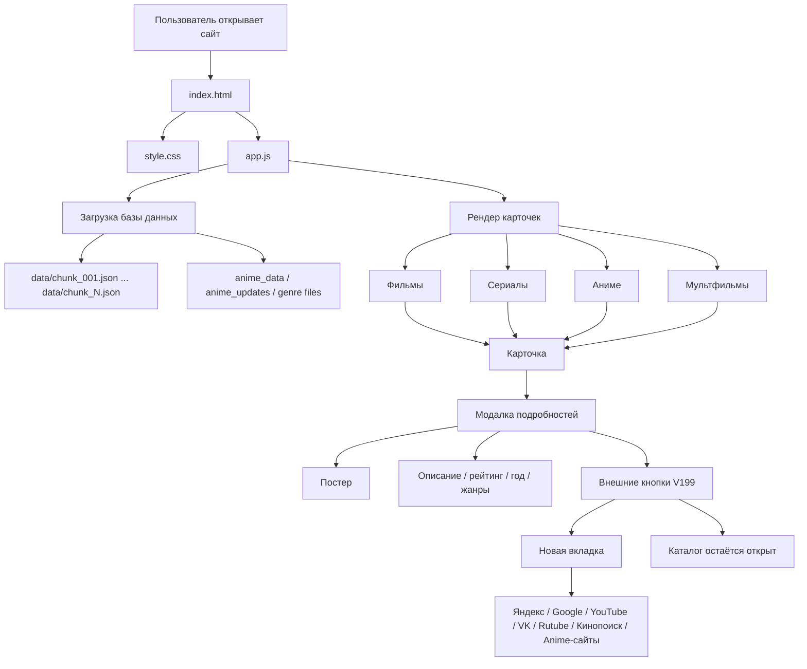
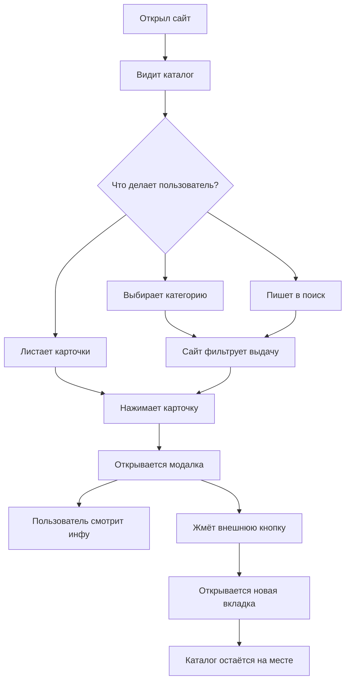
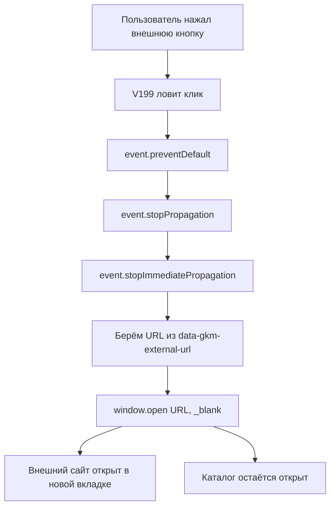
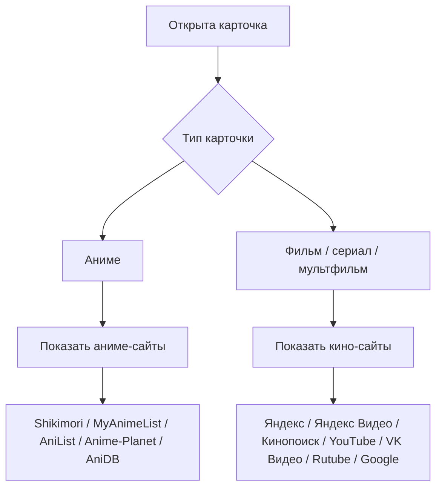

[Uploading GKM_PROJECT_SCHEME_V1.md…]()
[GKM_PROJECT_SCHEME_V1.md](https://github.com/user-attachments/files/29503592/GKM_PROJECT_SCHEME_V1.md)
# GKM PROJECT SCHEME V1
# «Голубь Каталог Мира» — карта сайта и логика проекта

Дата: 2026-06-29  
Проект: `films-series-best-5000`  
Назначение: каталог фильмов / сериалов / аниме / мультфильмов  
Текущая важная версия: `V199 CLEAN MODAL EXTERNAL LINKS`

---

## 0. Зачем нужен этот файл

Этот файл — не код, а **карта проекта**.

Он нужен, чтобы быстро понимать:

- какие файлы главные;
- как пользователь ходит по сайту;
- где живёт поиск;
- где живут карточки;
- где открывается модалка;
- где находятся внешние кнопки;
- какие старые патчи нельзя возвращать;
- куда смотреть, если сайт снова начнёт троить.

Правило проекта:

> Перед новым крупным патчем сначала смотреть эту схему, а не лепить новый костыль поверх старого.

---

## 1. Главная карта проекта



---

## 2. Основные файлы

| Файл / папка | За что отвечает | Важно |
|---|---|---|
| `index.html` | Каркас сайта | Подключает `style.css` и `app.js` |
| `style.css` | Внешний вид сайта | Карточки, сетка, модалка, мобильная версия |
| `app.js` | Главная логика сайта | Самый важный файл, тут поиск, фильтры, карточки, модалка |
| `data/chunk_*.json` | Основная база фильмов/сериалов/мультфильмов | Много файлов, не править вручную без нужды |
| `anime-tv/` | Отдельный блок/версия для anime-tv | Не путать с основной модалкой сайта |
| `.github/workflows/` | Автоматические GitHub-действия | Патчи/сборки/обновления |
| `README.md` | Краткое описание проекта | Сейчас почти пустой, можно расширить позже |

---

## 3. Как работает сайт для пользователя



---

## 4. Логика `app.js` крупными блоками

`app.js` — главный мозг сайта.

Примерная структура:

```txt
app.js
 ├─ Глобальные настройки и переменные
 ├─ Загрузка JSON-базы
 ├─ Нормализация данных
 ├─ Фильтры категорий
 ├─ Поиск
 ├─ Сортировка
 ├─ Рендер карточек
 ├─ Открытие модалки
 ├─ Заполнение модалки
 ├─ Внешние кнопки модалки
 │    └─ АКТУАЛЬНО: GKM V199 CLEAN MODAL EXTERNAL LINKS
 ├─ Мобильные обработчики
 └─ Дополнительные патчи версий
```

---

## 5. Модалка карточки

Модалка — это окно, которое открывается после клика на карточку.

В ней должно быть:

```txt
Модалка
 ├─ Постер
 ├─ Название
 ├─ Год
 ├─ Тип: фильм / сериал / аниме / мультфильм
 ├─ Рейтинг
 ├─ Жанры
 ├─ Описание
 ├─ Кнопки внешних сайтов
 └─ Закрытие модалки
```

Главное правило:

> Модалка не должна ломать текущую страницу и не должна уводить каталог на внешний сайт.

---

## 6. Внешние кнопки модалки

Актуальная версия:

```txt
GKM V199 CLEAN MODAL EXTERNAL LINKS
```

Задача V199:

- убрать дубли кнопок;
- открыть внешний сайт только в новой вкладке;
- не заменять текущий каталог внешним сайтом;
- для аниме показывать аниме-сайты;
- для фильмов/сериалов/мультфильмов показывать кино-сайты;
- работать на ПК и телефоне.

---

## 7. Схема внешних кнопок V199



---

## 8. Какие старые блоки нельзя возвращать

Эти блоки считаются конфликтными для внешних кнопок:

```txt
GKM V195 MODAL SITES BUTTONS FIX
GKM V197 MODAL BUTTONS NO DUPLICATE NO REDIRECT
GKM V198 SINGLE EXTERNAL CLICK FIX
```

Причина:

- они пытались чинить одну и ту же проблему;
- могли вешать несколько обработчиков клика;
- из-за этого кнопки могли троить;
- внешний сайт мог открываться и в новой вкладке, и вместо каталога.

Правило:

> Если кнопки внешних сайтов снова ломаются, не возвращать V195/V197/V198. Смотреть V199.

---

## 9. Разделение сайтов: аниме и кино



---

## 10. Что проверять после каждого патча

После любого изменения `app.js` проверять минимум это:

```txt
1. Сайт открывается.
2. Карточки видны.
3. Поиск работает.
4. Категории работают.
5. Модалка открывается.
6. Модалка закрывается.
7. Постер отображается.
8. Кнопки внешних сайтов без дублей.
9. Внешняя кнопка открывает новую вкладку.
10. Каталог не заменяется внешним сайтом.
11. На телефоне кнопки нажимаются.
12. Для аниме показываются аниме-сайты.
13. Для фильмов/сериалов/мультфильмов показываются кино-сайты.
```

---

## 11. Карта проблем и куда смотреть

| Проблема | Куда смотреть первым делом |
|---|---|
| Дубли кнопок в модалке | Блок V199, функция удаления старых блоков |
| Внешний сайт открывается вместо каталога | Обработчик клика V199, поиск `location.href`, `window.location`, `_self` |
| Кнопка открывает две вкладки | Дублирующиеся `addEventListener('click')` или старые V195/V197/V198 |
| Аниме показывает кино-сайты | Определение типа карточки в V199 |
| Фильм показывает аниме-сайты | Определение типа карточки в V199 |
| На телефоне кнопка не работает | CSS поверх кнопки, z-index, pointer-events, обработчик click/touch |
| Поиск тормозит | Логика поиска, размер базы, debounce, рендер карточек |
| Нет постеров | Фильтр постеров, поле poster/backdrop, загрузка изображений |

---

## 12. Как правильно делать новые версии

Неправильно:

```txt
Сломалось → добавить ещё один патч в конец app.js
```

Правильно:

```txt
1. Найти старый блок, который отвечает за проблему.
2. Удалить конфликтующий код.
3. Сделать один чистый блок новой версии.
4. Проверить, что старые версии не остались.
5. Прогнать базовые тесты.
6. Обновить этот файл схемы.
```

---

## 13. Журнал важных версий

| Версия | Смысл |
|---|---|
| V194 | Убирал плашку «Умная выдача V191» |
| V195 | Добавлял сайты в модалке, но начал конфликтовать |
| V197 | Пытался убрать дубли, но проблему полностью не решил |
| V198 | Пытался удалить V195/V197, но сам мог конфликтовать |
| V199 | Чистая версия внешних кнопок модалки |

---

## 14. Главное правило проекта

```txt
Один участок сайта = один главный обработчик.
```

Для внешних кнопок модалки главный обработчик сейчас:

```txt
GKM V199 CLEAN MODAL EXTERNAL LINKS
```

Старые обработчики на эту же задачу держать нельзя.

---

## 15. Что можно добавить в следующую схему V2

Позже можно расширить этот файл:

- отдельная схема поиска;
- отдельная схема фильтров;
- отдельная схема постеров;
- отдельная схема базы `data/chunk_*.json`;
- список всех функций `app.js`;
- список старых патчей, которые нужно удалить;
- карта мобильной версии;
- карта GitHub workflows.

---

Конец файла.


---

## GKM V207 GAME HUB POLISH TELEGRAM

Добавлено в игровой раздел:

- полировка карточек игр;
- постер-заглушка, если картинка не загрузилась;
- кнопка «Поделиться в Telegram»;
- кнопка «Скопировать ссылку»;
- блок «Фреш-проверка»: ProtonDB, Steam Deck, HowLongToBeat, Twitch, Reddit;
- улучшенная модалка игры: где играть, связанные фильмы/аниме/сериалы, во что играть после просмотра, хронология, похожее по вайбу.

Важное правило: игровой хаб остаётся отдельным модулем. Основной каталог фильмов/сериалов/аниме не смешивать с games_catalog без проверки.


## GKM V208 GAME UNIVERSES EXPANSION

- Актуальный игровой хаб расширен до 50+ игровых карточек.
- Добавлены связи `фильм/сериал/аниме → игра`, `игра → фильм`, `игра → сериал`, `игра → аниме`, `кино-вайб`.
- В модалке игры добавлен блок `🌍 Открыть вселенную`: игры, фильмы, сериалы, аниме/мульт вокруг одной франшизы.
- Добавлены блоки `🧭 Играть по порядку` и `🎬 Смотреть по порядку`.
- Подключение в `index.html`: `app.js?v=208`.
- Старую стабильную точку V207 можно вернуть заменой `app.js`, `index.html` и `data/games_catalog.json` на V207.


---

## V209 GAME HUB QUALITY FIX

- Рабочая точка после V208.
- Улучшены счётчики фильтров игрового раздела.
- Поиск по играм учитывает вселенную, хронологию, play/watch order и связанные медиа.
- Постеры защищены fallback-заглушкой и автозаменой Steam `header.jpg` на вертикальный `library_600x900_2x.jpg`.
- Блок `🌍 Открыть вселенную` получил счётчик связей.
- `index.html` подключает `app.js?v=209`.


## GKM V210 GAME GRID BORDER FIX

- Рабочая база: V209.
- Исправлена лишняя бирюзовая рамка вокруг всей сетки игр после поиска.
- В разделе Игры сетка не должна получать `gkm-v191-search-best`, outline или box-shadow.
- Подключение поднято до `app.js?v=210`.


## GKM V211 — Game collections + fast posters

- Добавлены игровые подборки: лучшие экранизации, сериалы, аниме, хоррор/зомби, фэнтези, фантастика, киберпанк, файтинги, семейное, культовые, новые.
- Игровые постеры оптимизированы: первая видимая партия грузится приоритетно, остальные лениво.
- Количество карточек на странице игр снижено до 24, чтобы первый экран открывался быстрее и не тянул сразу все 59 постеров.
- Подключение: `app.js?v=211`.

---

## GKM V212 BOOKS MANGA COMICS FOUNDATION

Важно: идея пользователя — расширить “Голубь Каталог Мира” до единого каталога, где вместе живут фильмы, сериалы, аниме, мультфильмы, игры, книги, манга и комиксы.

Добавлено:

```text
📚 Книги / Манга / Комиксы
 ├─ книги
 ├─ манга / ранобэ / новеллы
 ├─ комиксы
 ├─ первоисточники
 ├─ книга → фильм
 ├─ книга → сериал
 ├─ манга → аниме
 ├─ комикс → фильм / сериал / игра
 └─ книга / манга / комикс → игровая вселенная
```

Новый файл данных:

```text
data/books_catalog.json
```

Новый JS-блок:

```text
GKM V212 BOOKS MANGA COMICS FOUNDATION
```

Основные фичи:

```text
- новая вкладка 📚 Книги/Манга;
- карточки книг, манги и комиксов;
- фильтры: книги / манга / комиксы / первоисточники;
- подборки: → фильмы, → сериалы, → аниме, → игры, фэнтези, фантастика, супергерои, культовые;
- модалка Book Hub;
- кнопки Telegram и копировать ссылку;
- Google Books / Goodreads / ЛитРес / Author.Today / MangaLib / MangaDex / ReadManga;
- блок “🧭 С чего начать вселенную”;
- порядок чтения / просмотра / прохождения;
- связь с карточками фильмов, аниме и игр.
```

Откат V212:

```text
1. Вернуть app.js предыдущей версии.
2. Вернуть index.html с app.js?v=211.
3. Удалить data/books_catalog.json.
```


## GKM V213 CLEAN BUTTON SYSTEM + BOOK COVERS
- аккуратная система кнопок: главные разделы отдельно, подборки отдельно
- компактные чипы для фильтров книг/манги/комиксов
- обложки для книг, манги и комиксов
- улучшенная визуальная структура разделов

## GKM V214 REAL BOOK / MANGA / COMICS COVERS
- добавлены реальные обложки для книг, манги и комиксов через стабильные ISBN cover-ссылки
- fallback V213 оставлен: если обложка не загрузится, будет красивая типовая карточка
- раздел Книги/Манга визуально стал ближе к полноценному каталогу

## GKM V215 BOOKS MANGA COMICS EXPANSION
- раздел Книги/Манга расширен с 22 до 60 карточек
- добавлены новые манга, книги, комиксы и первоисточники
- сохранены реальные cover-ссылки и fallback-обложки
- связи с фильмами, сериалами, аниме и играми расширены

## GKM V216 MAX BOOK BASE + FAST LOAD
- раздел Книги/Манга расширен до 119 карточек
- JSON облегчен: тяжёлые встроенные fallback-обложки убраны
- fallback генерируется на лету, если у карточки нет настоящей обложки
- первая страница книг уменьшена до 18 карточек для быстрой загрузки
- видимые постеры получают приоритет, остальные грузятся лениво

## GKM V221 SPLIT BOOK DATABASE 1000+
- раздел Книги/Манга/Комиксы расширен до 1008 записей
- база разбита на отдельные файлы:
  - data/books/manga.json
  - data/books/ranobe.json
  - data/books/books.json
  - data/books/comics.json
  - data/books/index.json
- app.js сначала грузит split-файлы, если не получилось — combined data/books_catalog.json
- часть новых записей помечена sourceQuality=generated_seed: это заготовки для будущей ручной чистки и замены на точные обложки

## GKM V222 ALL BOOK POSTERS FIX
- исправлено "Нет постера" в разделе Книги/Манга/Комиксы
- для каждой видимой карточки без poster генерируется красивая обложка
- если внешняя обложка не загрузилась, включается fallback-обложка
- скорость сохранена: обложки генерируются только для текущей страницы, а не для всех 1008 сразу

## GKM V223 UNIVERSAL DESCRIPTIONS FIX
- добавлен универсальный блок подробного описания для фильмов, сериалов, аниме, мультфильмов, игр, книг, манги и комиксов
- если реальное описание короткое или отсутствует, сайт генерирует нормальное пояснение по типу, жанру, рейтингу, вселенной и связям
- цель: пользователь должен понимать, что он собирается смотреть / читать / играть, даже если видео не открывается внутри каталога

## GKM V224 GAME DATABASE EXPANSION
- Игры расширены с 59 до 360 записей
- добавлена split-структура data/games/*
- добавлены fallback-постеры для игр без poster
- combined data/games_catalog.json оставлен как запасной вариант

## GKM V225 MODAL FULL DESCRIPTION FIX
- описание теперь принудительно добавляется прямо в открытую модалку карточки
- работает даже если исходное описание короткое или обрезанное
- добавлен блок "📖 Подробное описание" для фильмов, сериалов, аниме, мультфильмов, игр, книг, манги, ранобэ и комиксов
- старый короткий обрезок описания визуально приглушается, чтобы не мешал

## GKM V226 FORCE GAME DATABASE 360 FIX
- исправлено: раздел Игры мог оставаться на старом V211 и показывать 59 записей
- V226 принудительно подменяет рендер игр на расширенную базу
- если старый V211 отрисовался первым, V226 перерисовывает раздел
- ожидаемый результат: Игровые вселенные · 360 из 360 · V226

## GKM V235 CLEAN ROLLBACK FROM GOOD ZIP
- откат на рабочую версию из films-series-best-5000-main (6)(2).zip
- убраны последствия сломанных V228-V234
- cache bump app.js?v=235

## GKM V236 DESCRIPTION ONLY FIX
- исправление только описаний через displayOverview
- без изменений style.css, сетки, модалки и баз
- добавлены ручные синопсисы для популярных проектов
